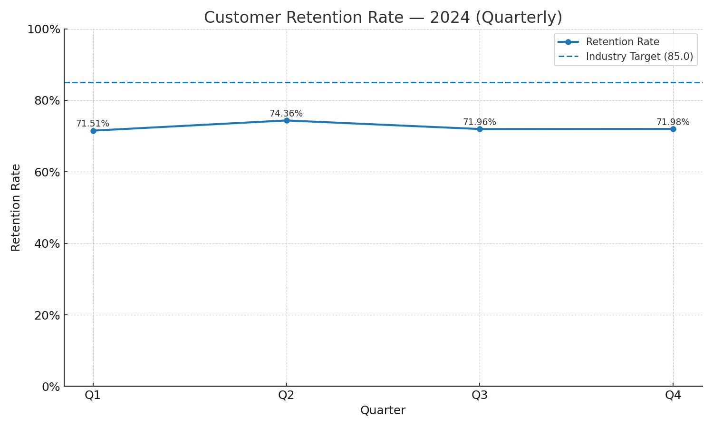

# Customer Retention Analysis — 2024

**Contact:** 24ds1000011@ds.study.iitm.ac.in

This repository contains code, data, and visuals for analyzing the company's **customer retention trend** in 2024 and comparing it to the **industry benchmark**.

## Dataset

Quarterly retention rates (2024):

| Quarter | Retention Rate (%) |
|--------:|--------------------:|
| Q1 | 71.51 |
| Q2 | 74.36 |
| Q3 | 71.96 |
| Q4 | 71.98 |

**Average (2024): 72.45**  
**Industry Target:** 85.00

## Key Findings

- The **average retention rate is 72.45**, which is **12.55 points below** the industry target (85).
- Retention **peaked in Q2 (74.36%)** but fell back to **~72%** in Q3 and Q4.
- The consistent gap indicates a **structural retention challenge**, not just seasonal noise.

## Business Implications

- The current retention levels imply **higher acquisition spend** to maintain growth, increasing **CAC** and depressing **LTV:CAC** ratios.
- Lower customer loyalty reduces **repeat purchase frequency** and **cross-sell/upsell** opportunities, impacting revenue predictability.
- Operating below benchmark may signal **experience or fulfillment gaps** that can erode brand equity over time.

## Recommendations

The solution is to **implement targeted retention campaigns** with measurable experiments:

1. **Lifecycle & Churn-Propensity Segmentation**  
   - Identify at-risk cohorts (first-time buyers, low NPS, delayed deliveries).  
   - Trigger tailored save-offers, re-engagement emails, or loyalty perks.

2. **Post-Purchase Experience & Fulfillment**  
   - Prioritize fast delivery SKUs and **promise-date accuracy**.  
   - Launch **proactive delay notifications** and recovery vouchers.

3. **Personalized CRM & Loyalty**  
   - Tiered loyalty program: points, birthday credits, free returns for higher tiers.  
   - Dynamic product recommendations based on recency/frequency/value (RFM).

4. **Experimentation & Targets**  
   - A/B test 2–3 campaign variants per quarter.  
   - Aim for a **+4 to +5 point** retention lift over 2 quarters, on path to 85.

## How to Reproduce

```bash
pip install -r requirements.txt
python src/analyze_retention.py
# output: retention_trend.png
```

## Visualization

The chart shows the 2024 quarterly trend with the benchmark line at 85%:


